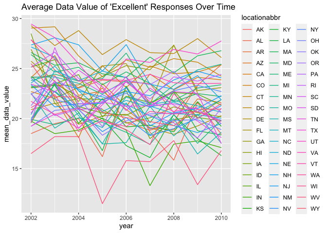

p8105_hw3_yd2739
================
Yuxuan Du
2023-10-05

``` r
library(tidyverse)
```

    ## ── Attaching core tidyverse packages ──────────────────────── tidyverse 2.0.0 ──
    ## ✔ dplyr     1.1.3     ✔ readr     2.1.4
    ## ✔ forcats   1.0.0     ✔ stringr   1.5.0
    ## ✔ ggplot2   3.4.3     ✔ tibble    3.2.1
    ## ✔ lubridate 1.9.2     ✔ tidyr     1.3.0
    ## ✔ purrr     1.0.2     
    ## ── Conflicts ────────────────────────────────────────── tidyverse_conflicts() ──
    ## ✖ dplyr::filter() masks stats::filter()
    ## ✖ dplyr::lag()    masks stats::lag()
    ## ℹ Use the conflicted package (<http://conflicted.r-lib.org/>) to force all conflicts to become errors

``` r
library(p8105.datasets)
```

## Problem 1

``` r
data("instacart")
tidy_instacart = instacart |>
  janitor::clean_names()
```

the size of the dataset is 1384617 x 15

The variables in the data are order_id, product_id, add_to_cart_order,
reordered, user_id, eval_set, order_number, order_dow,
order_hour_of_day, days_since_prior_order, product_name, aisle_id,
department_id, aisle, department

``` r
aisle_number = 
  tidy_instacart|>
  pull(
    aisle_id
  )|>
  unique()|>
  length()

aisle_ordered = tidy_instacart|>
  group_by(aisle)|>
  summarize(n_obs = n())|>
  arrange(desc(n_obs))

head(aisle_ordered)|>
  knitr::kable()
```

| aisle                         |  n_obs |
|:------------------------------|-------:|
| fresh vegetables              | 150609 |
| fresh fruits                  | 150473 |
| packaged vegetables fruits    |  78493 |
| yogurt                        |  55240 |
| packaged cheese               |  41699 |
| water seltzer sparkling water |  36617 |

There are 134 unique aisle in the dataset, and the most consumed aisle
is fresh vegetables.

``` r
aisle_plot = aisle_ordered|>
  subset(
    n_obs >= 10000
  )|>
  arrange(desc(n_obs))|>
  ggplot(aes(x = reorder(aisle, +n_obs), y = n_obs)) + 
  geom_bar(stat="identity") +
  theme(axis.text.x = element_text(angle = 90, vjust = 1, hjust=1)) +
  coord_flip()
        
aisle_plot
```

<!-- -->

``` r
popular_baking_ingredients_df = tidy_instacart|>
  subset(
    aisle == "baking ingredients"
  )|>
  group_by(product_name)|>
  summarize(n_obs = n())|>
  arrange(desc(n_obs)) |>
  head(3)|>
  mutate(
    category = "baking ingredients"
  )
popular_baking_ingredients_df|>
  knitr::kable()
```

| product_name      | n_obs | category           |
|:------------------|------:|:-------------------|
| Light Brown Sugar |   499 | baking ingredients |
| Pure Baking Soda  |   387 | baking ingredients |
| Cane Sugar        |   336 | baking ingredients |

``` r
popular_dog_food_care_df = tidy_instacart|>
  subset(
    aisle == "dog food care"
  )|>
  group_by(product_name)|>
  summarize(n_obs = n())|>
  arrange(desc(n_obs)) |>
  head(3)|>
  mutate(
    category = "dog food care"
  )
popular_dog_food_care_df|>
  knitr::kable()
```

| product_name                                  | n_obs | category      |
|:----------------------------------------------|------:|:--------------|
| Snack Sticks Chicken & Rice Recipe Dog Treats |    30 | dog food care |
| Organix Chicken & Brown Rice Recipe           |    28 | dog food care |
| Small Dog Biscuits                            |    26 | dog food care |

``` r
popular_packaged_vegetables_fruits_df = tidy_instacart|>
  subset(
    aisle == "packaged vegetables fruits"
  )|>
  group_by(product_name)|>
  summarize(n_obs = n())|>
  arrange(desc(n_obs)) |>
  head(3)|>
  mutate(
    category = "packaged vegetables fruits"
  )
popular_packaged_vegetables_fruits_df|>
  knitr::kable()
```

| product_name         | n_obs | category                   |
|:---------------------|------:|:---------------------------|
| Organic Baby Spinach |  9784 | packaged vegetables fruits |
| Organic Raspberries  |  5546 | packaged vegetables fruits |
| Organic Blueberries  |  4966 | packaged vegetables fruits |

``` r
three_items_merged = bind_rows(
  popular_baking_ingredients_df, 
  popular_dog_food_care_df, 
  popular_packaged_vegetables_fruits_df)|>
  arrange(desc(n_obs))|>
  knitr::kable()
  
three_items_merged
```

| product_name                                  | n_obs | category                   |
|:----------------------------------------------|------:|:---------------------------|
| Organic Baby Spinach                          |  9784 | packaged vegetables fruits |
| Organic Raspberries                           |  5546 | packaged vegetables fruits |
| Organic Blueberries                           |  4966 | packaged vegetables fruits |
| Light Brown Sugar                             |   499 | baking ingredients         |
| Pure Baking Soda                              |   387 | baking ingredients         |
| Cane Sugar                                    |   336 | baking ingredients         |
| Snack Sticks Chicken & Rice Recipe Dog Treats |    30 | dog food care              |
| Organix Chicken & Brown Rice Recipe           |    28 | dog food care              |
| Small Dog Biscuits                            |    26 | dog food care              |

``` r
apples_coffee_df = tidy_instacart|>
  subset(
    product_name == "Pink Lady Apples" | product_name == "Coffee Ice Cream"
  )|>
  group_by(order_dow, product_name)|>
  summarize(
    mean_hour = mean(order_hour_of_day, na.rm = TRUE)
  )|>
  mutate(
    order_dow = case_match(
      order_dow, 
      0 ~ "Sunday", 
      1 ~ "Monday", 
      2 ~ "Tuesday", 
      3 ~ "Wednesday", 
      4 ~ "Thursday", 
      5 ~ "Friday", 
      6 ~ "Saturday"
    )
  )|>
  knitr::kable(digits = 1)
```

    ## `summarise()` has grouped output by 'order_dow'. You can override using the
    ## `.groups` argument.

``` r
apples_coffee_df
```

| order_dow | product_name     | mean_hour |
|:----------|:-----------------|----------:|
| Sunday    | Coffee Ice Cream |      13.8 |
| Sunday    | Pink Lady Apples |      13.4 |
| Monday    | Coffee Ice Cream |      14.3 |
| Monday    | Pink Lady Apples |      11.4 |
| Tuesday   | Coffee Ice Cream |      15.4 |
| Tuesday   | Pink Lady Apples |      11.7 |
| Wednesday | Coffee Ice Cream |      15.3 |
| Wednesday | Pink Lady Apples |      14.2 |
| Thursday  | Coffee Ice Cream |      15.2 |
| Thursday  | Pink Lady Apples |      11.6 |
| Friday    | Coffee Ice Cream |      12.3 |
| Friday    | Pink Lady Apples |      12.8 |
| Saturday  | Coffee Ice Cream |      13.8 |
| Saturday  | Pink Lady Apples |      11.9 |

## Problem 2

``` r
#data cleaning
data("brfss_smart2010")
BRFSS_cleaned = brfss_smart2010 |>
  janitor::clean_names()|>
  subset(
    topic == "Overall Health"
  )|>
  subset(
    response == "Excellent" | response == "Very Good" | response == "Good"|response == "Fair"|response == "Poor"
  )|>
  mutate(
    response = factor(response, level=c("Poor", "Fair", "Good", "Very Good", "Excellent"))
  )
```

``` r
seven_or_more_2002 = BRFSS_cleaned|>
  subset(year == 2002)|>
  group_by(locationabbr)|>
  summarize(n_loc = n_distinct(locationdesc))|>
  subset(n_loc >= 7)|>
  arrange(desc(n_loc))
seven_or_more_2002|>
  knitr::kable()
```

| locationabbr | n_loc |
|:-------------|------:|
| PA           |    10 |
| MA           |     8 |
| NJ           |     8 |
| CT           |     7 |
| FL           |     7 |
| NC           |     7 |

In 2002, PA, MA, NJ, CT, FL, NC are states observed at 7 or more
locations.

``` r
seven_or_more_2010 = BRFSS_cleaned|>
  subset(year == 2010)|>
  group_by(locationabbr)|>
  summarize(n_loc = n_distinct(locationdesc))|>
  subset(n_loc >= 7)|>
  arrange(desc(n_loc))
seven_or_more_2010|>
  knitr::kable()
```

| locationabbr | n_loc |
|:-------------|------:|
| FL           |    41 |
| NJ           |    19 |
| TX           |    16 |
| CA           |    12 |
| MD           |    12 |
| NC           |    12 |
| NE           |    10 |
| WA           |    10 |
| MA           |     9 |
| NY           |     9 |
| OH           |     8 |
| CO           |     7 |
| PA           |     7 |
| SC           |     7 |

In 2002, FL, NJ, TX, CA, MD, NC, NE, WA, MA, NY, OH, CO, PA, SC are
states observed at 7 or more locations.

``` r
excellent_df = BRFSS_cleaned|>
  subset(
    response == "Excellent"
  )|>
  group_by(year, locationabbr)|>
  summarize(mean_data_value = mean(data_value))
```

    ## `summarise()` has grouped output by 'year'. You can override using the
    ## `.groups` argument.

``` r
excellent_plot = excellent_df|>
  ggplot(aes(x = year, y = mean_data_value))+
  geom_line(aes(color = locationabbr))
excellent_plot
```

    ## Warning: Removed 3 rows containing missing values (`geom_line()`).

<!-- -->

I’m not sure this is the plot we required to do. It looks not tidy and
hard for any interpretation.
